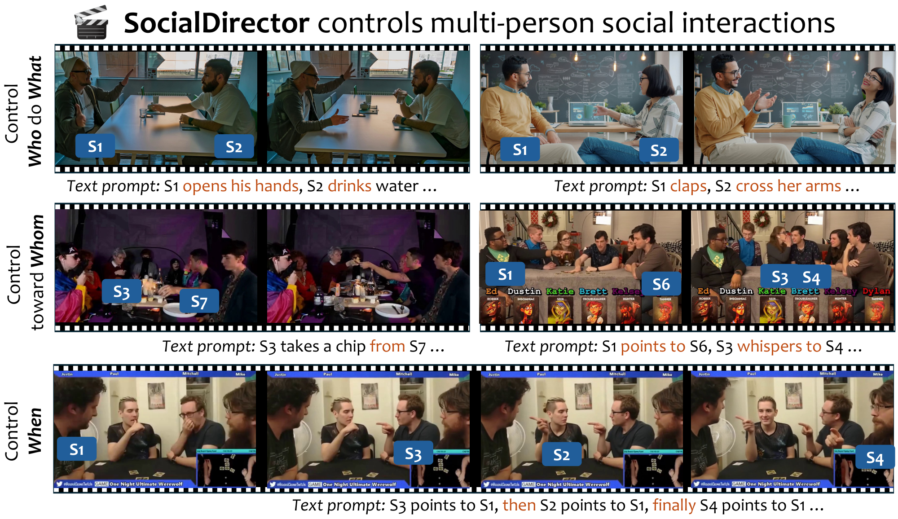
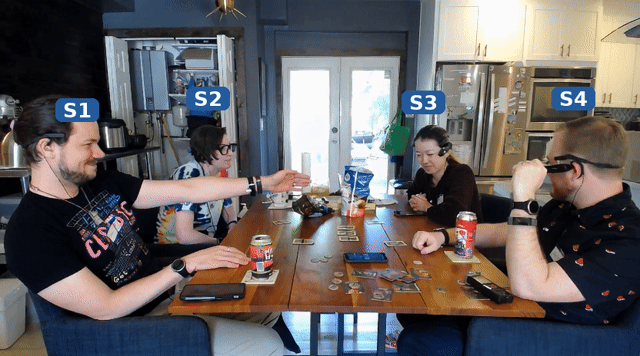
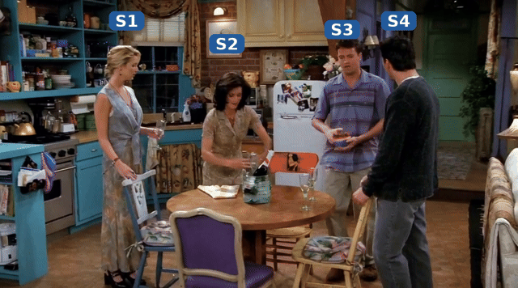
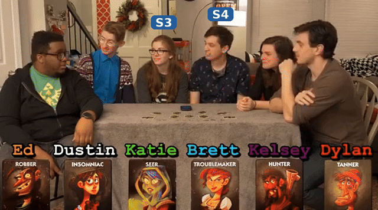
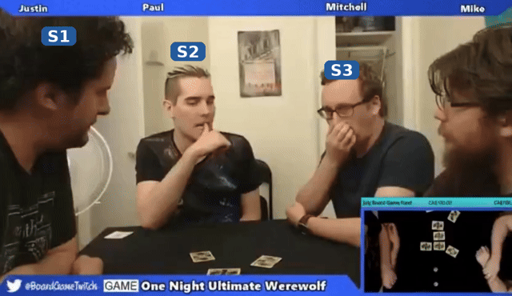

# SocialDirector: Training-Free Social Interaction Control for Multi-Person Video Generation

Liangyang Ouyang, Ruicong Liu, Caixin Kang, Yifei Huang, Yoichi Sato

The University of Tokyo



**SocialDirector** is a training-free controller that enhances multi-person video generation with explicit control over social interactions. Given a first frame and a set of social events — *who* performs *what* action, *when* it occurs, and *toward whom* it is directed — it generates a video in which each person faithfully carries out their specified interactions while preserving video quality.

Alongside the paper, we release the **SocialDirector Dataset**: 149 five-second multi-person clips from three domains (MELD, MMSI, SocialGesture) with 674 annotated persons and 479 timestamped, target-annotated social events.

## Paper

📄 [arXiv:2605.10079](https://arxiv.org/abs/2605.10079)

## Examples

<table>
  <tr>
    <td colspan="2"><em>Control who and what: S1 lowers his hand, S2 gives a thumbs-up, S3 smiles in joy, S4 remains still without actions:</em></td>
  </tr>
  <tr>
    <td colspan="2"></td>
  </tr>
  <tr>
    <td colspan="2"><em>Control toward whom: S2 puts down the cups and smiles to S1. S3 high five with S4:</em></td>
  </tr>
  <tr>
    <td colspan="2"></td>
  </tr>
  <tr>
    <td colspan="2"><em>Control toward whom: S3 whispers to S4:</em></td>
  </tr>
  <tr>
    <td colspan="2"></td>
  </tr>
  <tr>
    <td colspan="2"><em>Control when: S3 points to S1, then S2 points to S1:</em></td>
  </tr>
  <tr>
    <td colspan="2"></td>
  </tr>
</table>

## Dataset

Our evaluation dataset — **149 five-second clips** curated from three source datasets spanning distinct domains — is released with full annotations:

| Source | Clips | Domain |
|--------|-------|--------|
| [MELD](https://affective-meld.github.io/) | 19 | TV-series multi-party conversations |
| MMSI | 50 | Real-world social interactions (Ego4D & YouTube) |
| SocialGesture | 80 | Social game recordings |

Each clip is annotated with a structured prompt, per-person bounding boxes, and timestamped social events `(who, what, when, toward whom)` — 674 persons and 479 events in total.

📦 Download from Hugging Face: [`oyly/SocialDirector-Dataset`](https://huggingface.co/datasets/oyly/SocialDirector-Dataset)

The annotation file is also mirrored in this repo at [`dataset/annotations.json`](dataset/annotations.json) — see [`dataset/README.md`](dataset/README.md) for the format specification.

## Release Schedule

- [x] Demo release
- [x] Dataset release (149 videos + annotations)
- [ ] Inference code release

## Citation

```bibtex
@article{ouyang2026socialdirector,
  title   = {SocialDirector: Training-Free Social Interaction Control for Multi-Person Video Generation},
  author  = {Ouyang, Liangyang and Liu, Ruicong and Kang, Caixin and Huang, Yifei and Sato, Yoichi},
  journal = {arXiv preprint arXiv:2605.10079},
  year    = {2026}
}
```

## Contact

For questions, please contact oyly@iis.u-tokyo.ac.jp.
